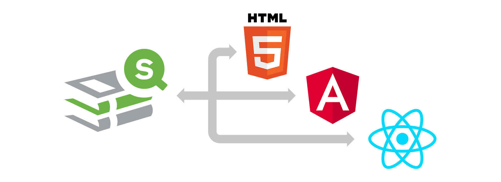

 

[]()

# Qlik Demo Team Components

- Qlik-powered components built by the Qlik Demo Team. For use with simple html, Angular2+ and React

### Installation
- `npm install --save qdt-components`

### Usage

#### Simple Html Example
- Download the [latest build](../blob/master/dist/qdt-components.js)
- Add the Html
```html
    <head>
        <script type="text/javascript" src="qdt-components.js"></script>
    </head>
    <body>
        <qdt-component id="qdt1"></qdt-component>
    </body>
```
- Add the Javascript
```javascript
    <script type="text/javascript">
        var qConfig = {
            "config": {
                "host": "sense-demo.qlik.com",
                "secure": true,
                "port": 443,
                "prefix": "/",
                "appId": "133dab5d-8f56-4d40-b3e0-a6b401391bde"
            },
            "connections": { 
                "vizApi": true, 
                "engineApi": false 
            }
        }
        var qdtComponents = new QdtComponents(qConfig.config, qConfig.connections);
        var element = document.getElementById('qdt1');
        qdtComponents.render('QdtViz', {id: 'a5e0f12c-38f5-4da9-8f3f-0e4566b28398', height:'300px'}, element);
    </script>
```
- [Live Demo](https://webapps.qlik.com/qdt-components/plain-html/index.html)

#### Angular 5 Component (cli)
```javascript
import { Component, OnInit, ElementRef, Input } from '@angular/core';
import QdtComponents from 'qdt-components';
let qConfig = {
    "config": {
        "host": "sense-demo.qlik.com",
        "secure": true,
        "port": 443,
        "prefix": "/",
        "appId": "133dab5d-8f56-4d40-b3e0-a6b401391bde"
    },
    "connections": { 
        "vizApi": true, 
        "engineApi": true 
    }
}

@Component({
	selector: 'qdt-component',
	templateUrl: './qdt-component.component.html',
	styleUrls: ['./qdt-component.component.less']
})
export class QdtComponent implements OnInit {

	@Input() Component: Function;
    @Input() props: object;

    static qdtComponents = new QdtComponents(qConfig.config, qConfig.connections);

	constructor(private elementRef: ElementRef) { }

	ngOnInit() {
        QdtComponent.qdtComponents.render(this.Component, this.props, this.elementRef.nativeElement);
	}

}
```

#### React
```javascript
import React from 'react';
import PropTypes from 'prop-types';
import QdtComponents from 'qdt-components';

const options = {
    "config": {
        "host": "sense-demo.qlik.com",
        "secure": true,
        "port": 443,
        "prefix": "/",
        "appId": "133dab5d-8f56-4d40-b3e0-a6b401391bde"
    },
    "connections": { 
        "vizApi": true, 
        "engineApi": true 
    }
}

const qdtComponents = new QdtComponents(options.config, options.connections);

export default class QdtComponent extends React.Component {
  static propTypes = {
    type: PropTypes.string.isRequired,
    props: PropTypes.object.isRequired,
  }
  componentDidMount() {
    const { type, props } = this.props;
    qdtComponents.render(type, props, this.node);
  }

  render() {
    return (
      <div ref={(node) => { this.node = node; }} />
    );
  }
}
```

### Component Docs ###

#### QdtViz
This component can be used to create or get a native Qlik Sense viz. If you define the `id` prop, then it will get that Qlik Sense viz. If you define the `type`, `cols`, and `options` props it will create a new viz. The `width` and `height` props are both optional, and default to '100%'.
| prop             | type          | description   |
| ---------------- | ------------- | ------------- |
| id               | String        | Id for an existng visualization |
| type             | String        | [see here][vizApiCreate] |
| cols             | Array         | [see here][vizApiCreate] |
| options          | Object        | [see here][vizApiCreate] |
| width            | String        | Sets width of viz |
| height           | String        | Sets height of viz |

#### QdtFilter
This creates a custom filter dropdown. If `cols` is defined, `qListObjectDef` will be ignored.
| prop             | type          | description   |
| ---------------- | ------------- | ------------- |
| cols             | Array         | [see here][cols] |
| qListObjectDef   | Object        | [see here][qListObjectDef] |

[vizApiCreate]: https://help.qlik.com/en-US/sense-developer/February2018/Subsystems/APIs/Content/CapabilityAPIs/VisualizationAPI/create-method.htm
[cols]: https://help.qlik.com/en-US/sense-developer/February2018/Subsystems/APIs/Content/CapabilityAPIs/VisualizationAPI/columns.htm
[qListObjectDef]: https://help.qlik.com/en-US/sense-developer/February2018/Subsystems/EngineAPI/Content/GenericObject/PropertyLevel/ListObjectDef.htm

### Changelog ###

##### 1.1.5 #####
* Add Picasso Horizontal Barchart

##### 1.1.4 #####
* Fix the Selection Toolbar
